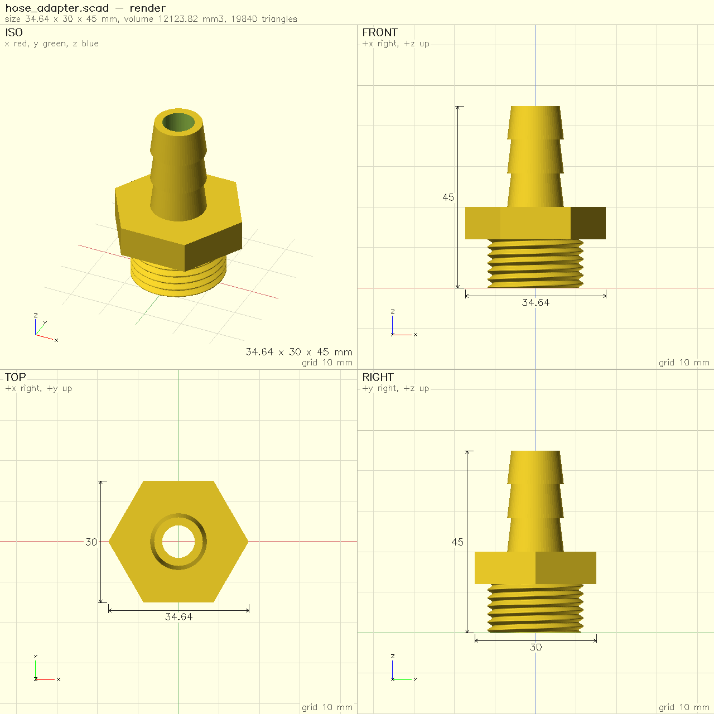

NeoSCAD is a new implementation of [OpenSCAD](https://openscad.org)'s
language, written in Rust. If you write `.scad` files today, the short
version is: **your models and libraries run as they are, and you get a
set of tools around them that OpenSCAD doesn't have.** This post goes
through both halves, and through the places where NeoSCAD still
differs.

## What stays the same

- **The language.** NeoSCAD reads OpenSCAD's language, and OpenSCAD's
  own regression suite is its specification: 1,773 of its in-scope
  tests pass, and a change to NeoSCAD may not make a passing test fail.
- **Your libraries.** MCAD and OpenSCAD's default Liberation fonts are
  built in. BOSL2 works from your library path as it does in OpenSCAD,
  and all 3,569 of BOSL2's example and test files give the same echo
  output as the OpenSCAD nightly.
- **The command line.** `neoscad model.scad -o model.stl` works as you
  know it, with OpenSCAD's export formats, `-D` variables, customizer
  parameter files (`-p`/`-P`) and camera options for PNG export.

```openscad try=csg
// CSG.scad - Basic example of CSG usage

translate([-24,0,0]) {
    union() {
        cube(15, center=true);
        sphere(10);
    }
}

intersection() {
    cube(15, center=true);
    sphere(10);
}

translate([24,0,0]) {
    difference() {
        cube(15, center=true);
        sphere(10);
    }
}
```

## What NeoSCAD adds

### Speed

On the [benchmark](/benchmarks.html), 14 models rendered to STL on one
Apple M4 Pro, NeoSCAD is about 3.8× faster than the OpenSCAD nightly
with its Manifold backend once process startup is subtracted. The
geometric mean with startup included is 5.0×. The page has the full
table, the method and the caveats. You can also run the same benchmark
on your own machine with `neoscad bench`, and submit the result to the
[community results](/community.html).

### A printability check

`neoscad check` renders the model and reports what would go wrong on an
FDM printer. Each finding says where it is and how to fix it:

- a solid that isn't manifold, or breaks when written at STL's 32-bit
  precision;
- pieces floating above the bed, and surfaces that would print fused;
- walls thinner than the nozzle or your minimum wall;
- overhangs steeper than your limit;
- parts that intersect, and a model that doesn't fit your bed.

```sh
neoscad check part.scad --nozzle 0.4 --min-wall 1.2 --bed 256x256x256
```

### Snapshots and measurements

`neoscad snapshot` draws a model's standard views as one dimensioned
PNG sheet, and `--issues` paints the check's findings onto it.
`neoscad measure` reports volume, area, bounding box, centre of mass,
distances between parts and cross-sections.



### A warm render server

`neoscad serve` keeps a model's caches warm and re-renders only what an
edit changed. On the gearbox model on the home page, an edit to one
part re-renders in about 0.25 s. The macOS app is built on the same
engine.

### Tools for AI agents

NeoSCAD is built to be driven by AI coding agents as well as people:

- **An MCP server**, `neoscad mcp`, which Claude Code, Cursor or any
  MCP client can use to evaluate, render, check, measure and snapshot a
  model.
- **JSON output** from every command (`--format json`).
- **Resource limits**, `--limit time=…` or `memory=…`, so a runaway
  model stops with an error instead of filling the machine. Like
  OpenSCAD, NeoSCAD sets no limits by default.

[Using NeoSCAD with AI agents](/agents.html) has the setup for each
agent, every tool and a worked example.

### Editor support, formatting and tests

- `neoscad lsp` is a language server: diagnostics and completion in any
  editor that speaks the Language Server Protocol.
- `neoscad fmt` formats `.scad` files, keeping comments, and checks on
  every file that the program is unchanged.
- `neoscad test` runs model tests: `module test_*()` in `*_test.scad`
  files, with `// @expect` lines.
- `neoscad docs` gives the reference for builtins, and for the modules
  and functions of a file.

### Named parts

With `--enable part`, `part("name") { ... }` names a piece of a model,
so `check` and `measure` can report on it by name. It is a NeoSCAD
extension, off by default, so files stay OpenSCAD-compatible unless
you opt in.

### In the browser

[OpenSCAD in your browser](/try/), at neoscad.org/try, runs the same
engine compiled to WebAssembly, on your machine, with nothing to install. It includes
BOSL2 examples, and it can connect to your AI agent so the agent edits
the model you have open while you watch.

## Where NeoSCAD still differs

::: note What's not there yet
- Geometry uses Manifold only; there is no CGAL backend.
- `text()` uses the bundled Liberation fonts; system fonts aren't found
  yet.
- The macOS app has no Animate panel, and its customizer is partial.
- The Windows and Linux apps are previews.
:::

We don't know of a model where NeoSCAD is slower than the OpenSCAD
nightly, but we have measured only so many. If you find one, or a model
that gives a different result, please
[open an issue](https://github.com/neoscad/neoscad/issues).

## Try it

| Where | How |
|---|---|
| macOS (Homebrew) | `brew install neoscad/tap/neoscad` |
| Everything else | the [download page](/download.html) |
| Your browser | [neoscad.org/try](/try/) |

NeoSCAD is open source under GPL-2.0-or-later, OpenSCAD's licence, at
[github.com/neoscad/neoscad](https://github.com/neoscad/neoscad). It is
an independent project, not affiliated with or endorsed by the OpenSCAD
project, and it exists because of OpenSCAD's language, examples and
test suite.
